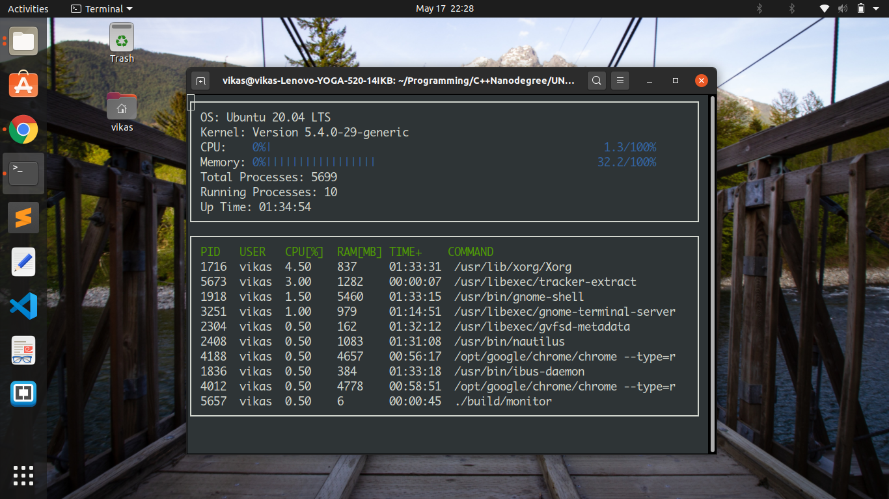

# System-Monitor
## Introduction
System monitor for Linux Operating system developed using C++ language. This is used to display operating system name, kernel version, CPU utilization, memory utilization, total processes, running processes and top 10 most CPU intensive processes using ncurses library in C++.

